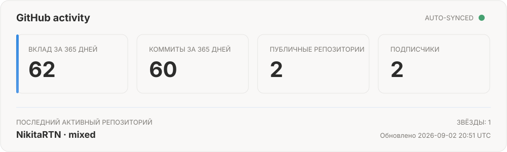

  

  
  

## Сейчас в работе

### [MCP Hub 3](https://github.com/NikitaRTN/mcp-stack)

Self-hosted панель для управления MCP-серверами: единая HTTPS-точка входа, OAuth, Tools Explorer, журнал вызовов в реальном времени и управление локальными процессами.

- backend без обязательных Python-зависимостей;
- интерфейс на чистом JavaScript без build step;
- тесты на Windows и Linux;
- безопасные настройки по умолчанию.

## Проверяемая активность

Данные на карточке берутся напрямую из GitHub API и автоматически обновляются каждые 6 часов. Никаких вручную нарисованных чисел.

## Публичные проекты и вклад

- **[mcp-stack](https://github.com/NikitaRTN/mcp-stack)** — автор и разработчик MCP Hub 3.
- **[SkHttp-Rework](https://github.com/RiseShieldDev/SkHttp-Rework)** — администрирование и разработка Java-аддона для HTTP/HTTPS в Minecraft Skript.
- **[SkriptWebAPI](https://github.com/RiseShieldDev/SkriptWebAPI)** — администрирование и вклад в Java-проект организации RiseShieldDev.

## Рабочий стек

`Python` · `JavaScript` · `Java` · `Git` · `GitHub Actions` · `HTTP/SSE` · `OAuth` · `SQLite`

  Профиль показывает только то, что можно проверить по открытым репозиториям и GitHub API.

