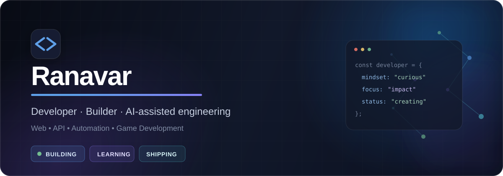

**Превращаю идеи в работающие продукты — от первого прототипа до готового решения.**

<picture>
  <source media="(prefers-color-scheme: dark)" srcset="https://raw.githubusercontent.com/NikitaRTN/NikitaRTN/main/profile-summary-card-output/github_dark/0-profile-details.svg" />
  
</picture>

<picture>
  <source media="(prefers-color-scheme: dark)" srcset="https://raw.githubusercontent.com/NikitaRTN/NikitaRTN/main/profile-summary-card-output/github_dark/3-stats.svg" />
  
</picture>
<picture>
  <source media="(prefers-color-scheme: dark)" srcset="https://raw.githubusercontent.com/NikitaRTN/NikitaRTN/main/profile-summary-card-output/github_dark/1-repos-per-language.svg" />
  
</picture>

  

