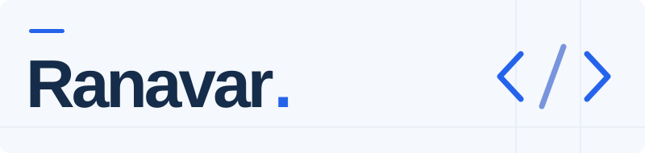

<picture>
  <source media="(prefers-color-scheme: dark)" srcset="assets/profile-dark.svg">
  <source media="(prefers-color-scheme: light)" srcset="assets/profile-light.svg">
  
</picture>

<b>Backend · Developer Tools · Game Integrations</b>

  Создаю инструменты для разработчиков, 
  MCP-инфраструктуру и интеграции для игровых серверов.

 

## Сейчас в фокусе

### [MCP Hub 3 ↗](https://github.com/NikitaRTN/mcp-stack)

Self-hosted рабочее пространство для MCP-сервисов: управление процессами, HTTPS через Caddy, OAuth, исследование инструментов и журнал вызовов в реальном времени.

`Python` · `JavaScript` · `SQLite`

[Исходный код](https://github.com/NikitaRTN/mcp-stack) · [Документация](https://github.com/NikitaRTN/mcp-stack#readme) · [Обсуждение задач](https://github.com/NikitaRTN/mcp-stack/issues)

## Другие проекты

**[OpenDoter ↗](https://github.com/NikitaRTN/OpenDoter)** 
Веб-интерфейс для просмотра матчей и игроков Dota 2. `PHP`

**[OpenDoter API ↗](https://github.com/NikitaRTN/OpenDoter-API)** 
API-сервис и парсер реплеев Dota 2. `Java` · `Python`

**[SkHttp-Rework ↗](https://github.com/NikitaRTN/SkHttp-Rework)** 
HTTP/HTTPS-запросы и web-интеграции для Minecraft Skript. `Java`

Также в профиле: [SkriptWebAPI](https://github.com/NikitaRTN/SkriptWebAPI) — fork Web API и HTTP-сервера для Skript.

## Технологии

**Языки** · Java, Python, JavaScript, PHP 
**Инструменты** · Git, GitHub Actions, SQLite, Caddy 
**Интеграции** · MCP, HTTP, OAuth, SSE

---

[Все репозитории ↗](https://github.com/NikitaRTN?tab=repositories) · Вопросы и предложения — в Issues соответствующего проекта.
