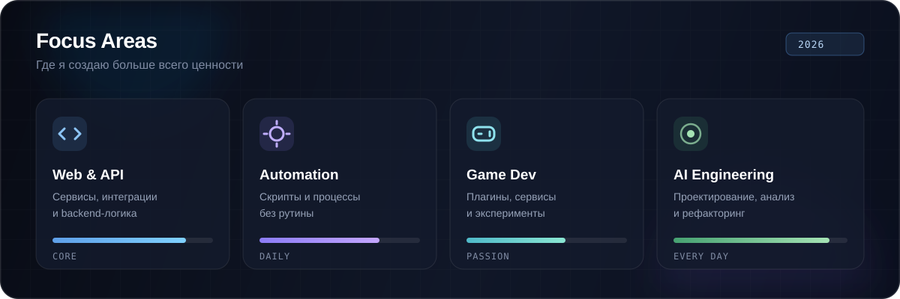
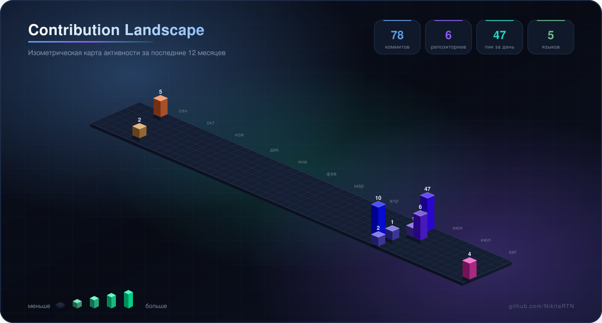

 

**Превращаю идеи в работающие продукты — от первого прототипа до готового решения.**

## `01` Обо мне

Я разработчик, которому нравится **создавать, исследовать и доводить идеи до результата**. Работаю с веб-приложениями, API, автоматизацией и игровыми проектами. AI использую как инженерный инструмент: для анализа, проектирования, прототипирования, тестирования и рефакторинга.

<table>
<tr>
<td width="50%" valign="top">

### ⚡ Что создаю

- Веб-приложения и backend-сервисы
- API и интеграции между системами
- Автоматизацию повторяющихся процессов
- Игровые плагины и сервисы

</td>
<td width="50%" valign="top">

### 🧭 Как работаю

- Декомпозирую сложное на понятные шаги
- Быстро проверяю гипотезы прототипами
- Улучшаю архитектуру и читаемость кода
- Постоянно учусь через реальные проекты

</td>
</tr>
</table>

## `02` Технологический стек

### Languages

### Tools & Workflow

## `03` Focus Areas

## `04` 3D Contribution Landscape

Изометрическая карта коммитов за последние 12 месяцев — высота блока равна активности за день.

## `05` AI как часть разработки

> **AI усиливает инженерное мышление, но не заменяет его.** Я использую нейросети, чтобы быстрее исследовать варианты, находить слабые места и превращать прототипы в поддерживаемые решения.

<table>
<tr>
<td width="25%" align="center"><b>architecture</b> проектирование и декомпозиция</td>
<td width="25%" align="center"><b>debugging</b> поиск причин и проверка гипотез</td>
<td width="25%" align="center"><b>quality</b> тесты, документация и рефакторинг</td>
<td width="25%" align="center"><b>learning</b> освоение новых технологий</td>
</tr>
</table>

 

### Есть интересная идея? Давайте превратим её в код.

Если проект оказался полезным, звезда ⭐ — лучший способ поддержать его развитие.

